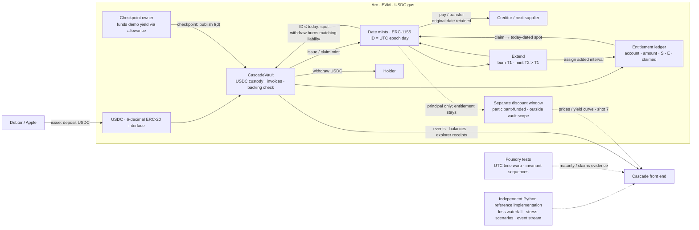

# Cascade: dated dollars on Arc

Solid arrows show the implemented vault path. Dashed arrows identify separate demo/reference components.
The discount window is participant-funded; it never draws on vault reserve. Dates are ERC-1155 IDs,
not separately deployed contracts. The reference implementation feeds the front end independently
of the Solidity build and test suite.

Shot 5 uses real extension events and entitlement intervals. Shot 7 needs the separate discount
window/reference price feed. Shot 9's accelerated maturity and loss stress are labeled reference
or local Foundry runs; public testnet time is never accelerated. Shot 11 uses the PNG rendered
from this Mermaid block by `contracts/scripts/render-architecture.mjs`.
