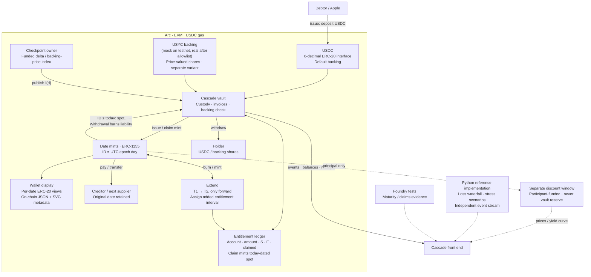

# Cascade: dated dollars on Arc

Solid arrows show vault operations and wallet views. Dashed arrows show the independent reference,
local test evidence, and participant-funded discount window. The backing boxes are alternatives:
USDC is the default; the USYC variant values shares using the backing price.

Date mints and their ERC-20 views share one ledger and one principal supply. Metadata is rendered
on-chain. The USYC mock is the demonstration stand-in; real USYC integration remains allowlist-gated.

Shot 5 uses extension events and entitlement intervals. Shot 7 uses the separate discount window
and reference pricing. Shot 9's accelerated maturity and loss stress are labeled local/reference
runs; public testnet time is never accelerated. Shot 11 uses [architecture.svg](architecture.svg).

The SVG is maintained directly at 1730 × 1200 with dedicated connector lanes and footer margins.
The Mermaid block records the same relationships. The legacy render script's layout has not been
updated in this revision; rasterize this SVG directly rather than regenerating it with that script.
